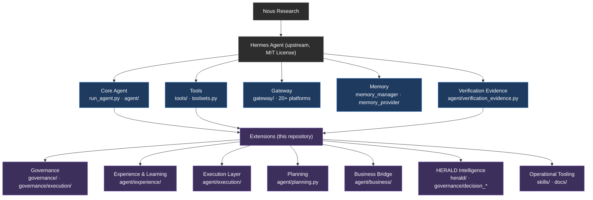
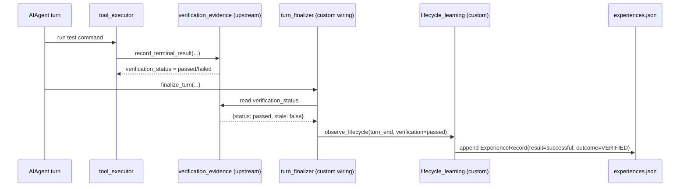
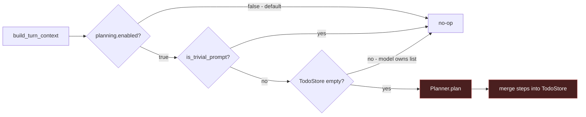

# Architecture

This document shows how the extensions in this repository sit on top of the
upstream Hermes Agent runtime, and what each layer is responsible for.

## High-level placement

## Layer responsibilities

### Upstream (Nous Research)

| Layer | What it provides | Where |
|---|---|---|
| Core Agent | Conversation loop, turn context, tool dispatch, prompt building | `run_agent.py`, `agent/` |
| Tools | Tool registry, built-in tools, toolset definitions | `tools/`, `toolsets.py` |
| Gateway | Platform adapters, session management, inbound/outbound routing | `gateway/` |
| Memory | Persistent memory provider, memory manager | `agent/memory_manager.py`, `agent/memory_provider.py` |
| Verification Evidence | SQLite-backed record of verification events + status API | `agent/verification_evidence.py` |

The extensions attach at three points: the core agent (for the learning and
planning wiring), the tool registry (for the execution layer's orchestrator),
and the verification-evidence database (for the learning loop's substrate).

### Extensions (this repository)

| Extension | Responsibility | Attaches at | Runtime |
|---|---|---|---|
| Governance | Decision memory, risk classification, approval workflow, knowledge graph, project registry, impact analysis, recommendation engine, architecture query | Plugin: `post_tool_call`, `on_session_end` | Partially active |
| Experience & Learning | Verify → Finalize → Learn → Persist → Recall | `finalize_turn`, `conversation_loop` | Active |
| Execution Layer | Governed, queued, persistent execution of a single tool call | Tool dispatch (intended; not yet wired) | Dormant |
| Planning | Deterministic goal → step list, seeded into `TodoStore` | `turn_context.py` hook | Dormant (flag off) |
| Business Bridge | Business entities → `ExecutionMemory` | `ExecutionMemory` API | Partial |
| HERALD Intelligence | Decision-performance loop with persistence | `ExecutionCoordinator.submit()` | Frozen / dormant |
| Operational Tooling | Original skills, architecture docs, phase reports | Skill system, filesystem | Active (skills) |

## Data-flow diagrams

### Verification → Learning (active)

### Execution Layer (dormant — the intended path)

*The flow is correct and tested, but no production code calls
`ExecutionCoordinator.submit()` yet. See `PROJECT_STATUS.md`.*

### Planning (dormant — the intended path)

## Boundary contracts

Every extension respects three boundary rules:

1. **No upstream file is modified.** Extensions live in new directories. The
   only change to the upstream tree is the addition of a plugin directory
   (`plugins/governance/`) that the upstream plugin loader discovers.

2. **The prompt cache is sacred.** No extension mutates past conversation
   context, swaps toolsets mid-conversation, or rebuilds the system prompt.
   Planning writes only to the `TodoStore`, never to the system prompt.

3. **Fail-safe.** Intelligence and governance calls are wrapped in
   `try/except` and degrade to safe defaults (`None`, `{}`, `False`). No
   extension can block a turn.

## Dependency notes

Some extensions import from upstream and therefore cannot run standalone:

| Module | Upstream imports |
|---|---|
| `agent/execution/orchestrator.py` | `tools.registry` |
| `agent/experience/listener.py` | `agent.verification_evidence` (via the wiring layer) |
| `agent/business/bridge/memory_bridge.py` | `agent.execution.memory` (this repo) |
| `governance/graph_builder.py` | `hermes_constants` |

This is a deliberate choice: reusing upstream infrastructure keeps the
extensions small. It also means the correct way to run them is inside a Hermes
Agent checkout — see the Development section in `README.md`.

## Cross-cutting principles

See [`docs/architecture.md`](docs/architecture.md) for a longer walkthrough of
each boundary and the design trade-offs behind them.