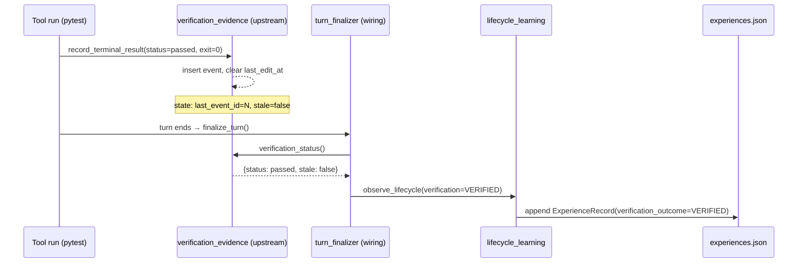

# Verification → Learning

**Location:** `agent/experience/` plus wiring in `turn_finalizer.py` and
`conversation_loop.py` (the wiring itself is custom; the upstream
`verification_evidence` module is the substrate).
**Ownership:** Custom (on upstream substrate).
**Runtime:** **Active and evidence-backed.**

## Purpose

Make learning conditional on verification. A turn that was verified — by a
canonical command recorded in the upstream verification-evidence database —
produces a learning record tagged `VERIFIED`. A turn that was not verified
produces a record tagged `UNVERIFIED` or `FAILED`.

The principle is stated once and applied everywhere:

> **No Evidence = No Claim.**

## The chain

## What makes the outcome `VERIFIED`

Three conditions must hold:

1. **An event exists.** The verification database has at least one event.
2. **The event is fresh.** No edit happened after the verification —
   `last_edit_at` is `NULL`, not older than `last_event_id`.
3. **The event passed.** The status is `passed` (exit code 0 for a canonical
   test command).

If all three hold, `finalize_turn` maps the state to `VERIFIED`.

## The learning record

Each turn produces one `ExperienceRecord` in `governance/experiences.json`:

| Field | Meaning |
|---|---|
| `id` | Unique record ID |
| `timestamp` | ISO-8601 |
| `problem` | The turn's goal (truncated) |
| `analysis` | Verification outcome, prefixed with an authoritative label |
| `result` | `successful` / `partial` / `failed` |
| `confidence` | Numeric confidence |
| `tags` | Includes `runtime_learning`, `verification`, and the outcome |
| `metadata.verification_outcome` | `VERIFIED` / `UNVERIFIED` / `FAILED` |
| `metadata.session_id` | Session this record came from |
| `metadata.turn_id` | Turn this record came from |

## Recall

On later turns, `recall_integration.py` searches prior records for a match to
the current task and — only if the record is recent enough, confident enough
(≥ 0.7), and its result is `successful` — injects the prior solution as
**advisory context**.

The injection is explicitly marked as advisory:

> `[System note: Relevant prior Hermes runtime experience. Treat this as
> advisory context, not as user input or new verification evidence.]`

This matters: prior experience must never be mistaken for user input or for
fresh verification evidence.

## Safety properties

1. **Advisory only.** Recall never overrides the model's decision.
2. **Confidence-gated.** Only high-confidence successful experiences are
   surfaced as reusable recommendations.
3. **Never a substitute for evidence.** Prior experience is labelled as
   advisory, never as a verification event.
4. **Cache-safe.** Recall enters as a system note in a new turn — it does not
   mutate past context.

## Evidence

In the development deployment:

- `verification_evidence.db` contains four events (IDs 1–4), including a
  `passed` event with exit code 0.
- `governance/experiences.json` contains ten records, the most recent tagged
  `successful` / `VERIFIED`.

These are runtime files and are **not** shipped in this repository. They are
cited here as the evidence behind the "Active" label in `PROJECT_STATUS.md`.

## Known gap

The `lessons_learned` field on the experience records is currently `None` on
every record, even though the design anticipated a list of lesson tags for
each outcome. This is a known incomplete edge of the learning pipeline and is
not presented here as working.

## Status

Active. This is the one extension in the repository that is fully wired into
the live runtime and produces observable output on every verified turn.